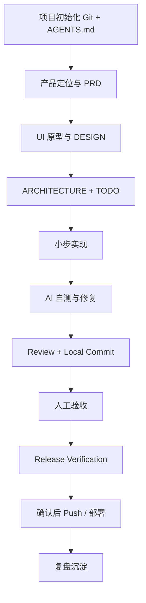

# Vibe Coding 项目开发 SOP

> 一套用于指导个人与 Codex Agent 共创 AI 项目的开发工作流。

核心原则：**人负责方向、判断、边界和最终验收；AI / Codex 负责执行、验证、补全和提效。**

目标不是让 AI “多写代码”，而是让整个过程更快、更稳、更容易回滚和复盘。

---

## 总体流程



---

## 核心原则

- **先想清楚，再开发**：先明确用户、问题、MVP 和技术可行性。
- **实现与验证是一件事**：AI 交付前先完成与风险匹配的自测。
- **Git 是 checkpoint**：每个独立且已验证的任务完成后创建本地 Commit。
- **本地自主，远端确认**：Local Commit 可自动完成，Push Remote 必须先确认。
- **按风险测试**：不强制每次新增测试，也不强制使用 Computer Use 等特定工具。
- **QA Agent 按需使用**：复杂或高风险任务可引入独立 QA Sub Agent，不作为默认步骤。
- **人做最终验收**：AI 负责证明“能正常工作”，人负责判断“是不是我们真正想要的产品”。

---

## 核心文档

- [完整 SOP](./docs/vibe-coding-sop.md)
- [PRD 模板](./docs/prd-template.md)
- [Design 模板](./docs/design-template.md)
- [Architecture 模板](./docs/architecture-template.md)
- [AGENTS 模板](./docs/agents-template.md)
- [Demo Script 模板](./docs/demo-script-template.md)

---

## 新项目推荐结构

```txt
project/
├── docs/
│   ├── PRD.md
│   ├── DESIGN.md
│   ├── ARCHITECTURE.md
│   └── TODO.md
├── AGENTS.md
├── .gitignore
└── README.md
```

---

## 推荐执行顺序

```txt
0. 初始化 Git、.gitignore 和基础 AGENTS.md
1. 和 AI 脑暴产品方向
2. 明确定位、用户、痛点、MVP 和技术可行性
3. 输出 PRD.md
4. 形成 UI 原型和 DESIGN.md
5. 输出 ARCHITECTURE.md
6. 补全 AGENTS.md
7. 生成 TODO.md
8. 按 TODO 小步开发
9. 每个 Task：实现 → 必要测试 → AI 自测 → 修复 → Review → Local Commit
10. Computer Use / QA Sub Agent 等按实际复杂度使用
11. 人工验收
12. 发布前完成 Release Verification
13. Push Remote 前由用户确认
14. 补 README / Demo，并复盘沉淀
```

---

## 一句话总结

> 最好的 Vibe Coding，不是让 AI 替你思考，而是让人负责方向与最终判断，让 AI 在清晰边界下自主完成「实现 → 验证 → 修复 → 留痕」。
>
> Git 让 AI Coding **可回退**，AI Self-Test 让它 **更可信**。
