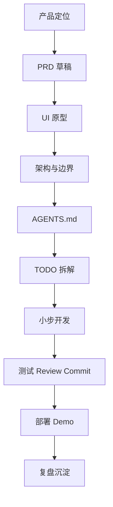

# Vibe Coding 项目开发 SOP

> 一套用于指导个人与 Codex Agent 共创 AI 项目的开发工作流。

核心原则：**人负责方向、判断、边界和验收；AI / Codex 负责执行、补全和提效。**

Vibe Coding 不是把一句想法丢给 AI 写代码，而是通过清晰的 SOP，把项目从「产品想法」推进到「可展示的 MVP」。

---

## 总体流程



---

## 适合谁使用

- 想用 AI 快速做 MVP 的产品经理
- 想用 Codex / Claude Code 辅助开发的 Builder
- 想把想法快速做成可 Demo 项目的人
- 想把 AI Coding 从「随机对话」变成「稳定流程」的人

---

## 核心文档

- [完整 SOP](./docs/vibe-coding-sop.md)
- [PRD 模板](./docs/prd-template.md)
- [Design 模板](./docs/design-template.md)
- [Architecture 模板](./docs/architecture-template.md)
- [AGENTS 模板](./docs/agents-template.md)
- [Demo Script 模板](./docs/demo-script-template.md)

---

## 最小使用方式

每次启动一个新 Vibe Coding 项目时，可以直接复制以下模板到新项目：

```txt
新项目/
├── docs/
│   ├── PRD.md
│   ├── DESIGN.md
│   ├── ARCHITECTURE.md
│   └── TODO.md
├── AGENTS.md
└── README.md
```

推荐顺序：

```txt
1. 和 AI 脑暴产品方向
2. 明确产品定位、目标用户、痛点和 MVP 边界
3. 做技术可行性初判，不展开详细技术方案
4. 输出 docs/PRD.md
5. 收集 UI 参考，生成 UI 原型
6. 输出 docs/DESIGN.md
7. 生成 docs/ARCHITECTURE.md
8. 创建 AGENTS.md，固化 Agent 开发规则
9. 生成 docs/TODO.md
10. 按 TODO 小步开发
11. 每完成一项就测试、review、commit
12. 新需求先判断大小，大需求先更新 PRD / ARCHITECTURE
13. 主流程跑通后做 UI polish
14. 部署到 Vercel / Netlify / Cloudflare
15. 补 README 和 Demo Script
16. 复盘并更新文档
```

---

## 一句话总结

> 最好的 Vibe Coding，不是让 AI 替你思考，而是你先把产品方向、MVP 边界和验收标准想清楚，再让 Codex 在清晰文档和开发规则下高速执行。
>
> 真正体现 Builder 能力的，不是代码量，而是你能否定义问题、控制范围、快速交付，并把项目讲成一个完整的产品故事。
